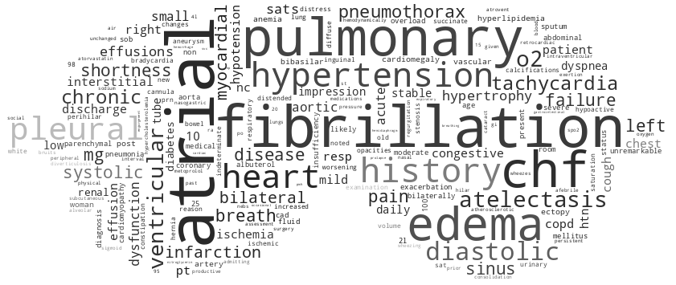

# OSA Phenotyping LLMs
Developing analytic tools for phenotyping Obstructive Sleep Apnea along clinical text.



---

## Dataset

We are using MIMIC-IV to study the phenotyping of obstructive sleep apnea (OSA) in ICU visits.
On NERSC, a local copy was pulled and stored under `/project/projectdirs/m1532/Projects_MVP/_datasets/MIMIC_IV`. The file structure of the dataset is as follows:

``` 
# tree -h MIMIC_IV/
.
└── [4.0K]  physionet.org
    ├── [4.0K]  files
    │   ├── [4.0K]  mimiciv
    │   │   └── [4.0K]  2.2
    │   │       ├── [ 13K]  CHANGELOG.txt
    │   │       ├── [4.0K]  hosp
    │   │       │   ├── [ 70M]  admissions.csv
    │   │       │   ├── [3.2M]  d_hcpcs.csv
    │   │       │   ├── [129M]  diagnoses_icd.csv
    │   │       │   ├── [8.4M]  d_icd_diagnoses.csv
    │   │       │   ├── [7.0M]  d_icd_procedures.csv
    │   │       │   ├── [ 62K]  d_labitems.csv
    │   │       │   ├── [ 40M]  drgcodes.csv
    │   │       │   ├── [3.6G]  emar.csv
    │   │       │   ├── [5.1G]  emar_detail.csv
    │   │       │   ├── [9.2M]  hcpcsevents.csv
    │   │       │   ├── [2.8K]  index.html
    │   │       │   ├── [ 13G]  labevents.csv
    │   │       │   ├── [707M]  microbiologyevents.csv
    │   │       │   ├── [254M]  omr.csv
    │   │       │   ├── [9.4M]  patients.csv
    │   │       │   ├── [2.8G]  pharmacy.csv
    │   │       │   ├── [3.6G]  poe.csv
    │   │       │   ├── [214M]  poe_detail.csv
    │   │       │   ├── [2.5G]  prescriptions.csv
    │   │       │   ├── [ 25M]  procedures_icd.csv
    │   │       │   ├── [277K]  provider.csv
    │   │       │   ├── [ 20M]  services.csv
    │   │       │   └── [150M]  transfers.csv
    │   │       ├── [4.0K]  icu
    │   │       │   ├── [ 89K]  caregiver.csv
    │   │       │   ├── [ 28G]  chartevents.csv
    │   │       │   ├── [742M]  datetimeevents.csv
    │   │       │   ├── [360K]  d_items.csv
    │   │       │   ├── [ 11M]  icustays.csv
    │   │       │   ├── [1.3K]  index.html
    │   │       │   ├── [1.9G]  ingredientevents.csv
    │   │       │   ├── [2.2G]  inputevents.csv
    │   │       │   ├── [349M]  outputevents.csv
    │   │       │   └── [123M]  procedureevents.csv
    │   │       ├── [ 789]  index.html
    │   │       ├── [2.5K]  LICENSE.txt
    │   │       └── [2.8K]  SHA256SUMS.txt
    │   └── [4.0K]  mimic-iv-note
    │       └── [4.0K]  2.2
    │           ├── [ 574]  index.html
    │           ├── [2.5K]  LICENSE.txt
    │           ├── [4.0K]  note
    │           │   ├── [1.1G]  discharge.csv.gz
    │           │   ├── [1.3M]  discharge_detail.csv.gz
    │           │   ├── [ 737]  index.html
    │           │   ├── [746M]  radiology.csv.gz
    │           │   └── [ 37M]  radiology_detail.csv.gz
    │           └── [ 439]  SHA256SUMS.txt
    └── [  22]  robots.txt

9 directories, 46 files
```

## Language Models

For this analysis, we explore the representation quality of several contempory language models.
X models have been stored locally on NERSC under `/project/projectdirs/m1532/Projects_MVP/_models/LLMs`.
The file structure for the LLMs is as follows:

```
tree -h LLMs/


```

## Analysis Workflow

> Previous work from summer 2022 is in repo under `src/old`. It contains scripts used for
building/searching MIMIC-III vocabs and patient cohorts by Dxs. Also, it contains the script to
fit a logistic regression model against presence/absence NLP variables.

For this analysis, we want to explore the how different pretrained large language models (LLMs) represent patient documents and observe if their is strong clustering w.r.t. commorbidities and outcome progression.
With this goal in mind, we will build tools to process MIMIC-IV notes with language models,
visualize the latent space of documents and map the resulting embeddings to longitudinal data.
The overall structure of the analysis is as follows:

1. Subset and label patient data by OSA-related dx.
2. Embed documents using LLMs.
3. Use UMAP to visualize latent pace and plot structured variables.
4. Measure correlation between clustering diversity and structured variables.

The following are the scripts used in the main workflow of the analysis:

```
.
├── LICENSE
├── README.md
├── data
└── src
    ├── 0_subset_MIMICIV_phenotype.py
    ├── 1_embedd_MIMICIV_records.py
    ├── 2_umap2D_MIMICIV_latent.py
    ├── 3_clustr_MIMICIV_latent.py
```