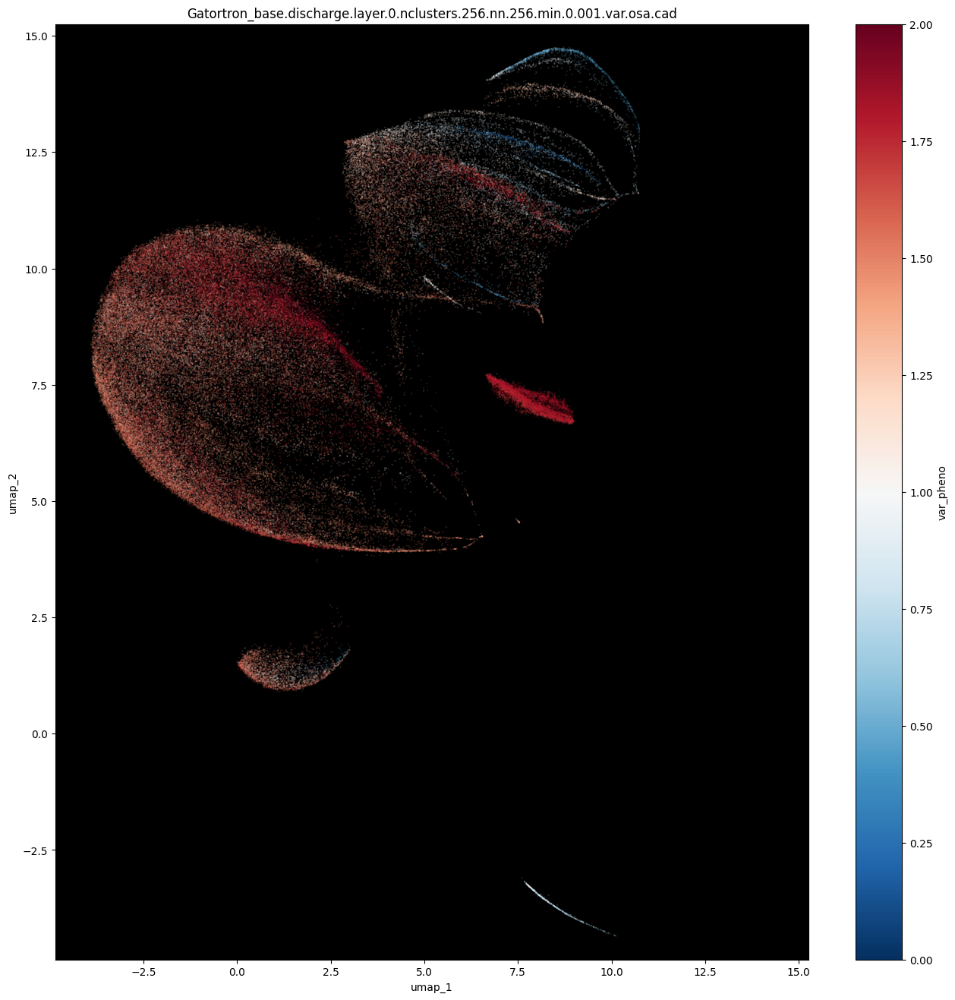

# OSA Phenotyping LLMs
Developing analytic tools for phenotyping Obstructive Sleep Apnea along clinical text.



---

## Dataset

We are using MIMIC-IV to study the phenotyping of obstructive sleep apnea (OSA) in ICU visits.
On NERSC, a local copy was pulled and stored under `/project/projectdirs/m1532/Projects_MVP/_datasets/MIMIC_IV`. The file structure of the dataset is as follows:

``` 
# tree -h MIMIC_IV/
.
└── [4.0K]  physionet.org
    ├── [4.0K]  files
    │   ├── [4.0K]  mimiciv
    │   │   └── [4.0K]  2.2
    │   │       ├── [ 13K]  CHANGELOG.txt
    │   │       ├── [4.0K]  hosp
    │   │       │   ├── [ 70M]  admissions.csv
    │   │       │   ├── [3.2M]  d_hcpcs.csv
    │   │       │   ├── [129M]  diagnoses_icd.csv
    │   │       │   ├── [8.4M]  d_icd_diagnoses.csv
    │   │       │   ├── [7.0M]  d_icd_procedures.csv
    │   │       │   ├── [ 62K]  d_labitems.csv
    │   │       │   ├── [ 40M]  drgcodes.csv
    │   │       │   ├── [3.6G]  emar.csv
    │   │       │   ├── [5.1G]  emar_detail.csv
    │   │       │   ├── [9.2M]  hcpcsevents.csv
    │   │       │   ├── [2.8K]  index.html
    │   │       │   ├── [ 13G]  labevents.csv
    │   │       │   ├── [707M]  microbiologyevents.csv
    │   │       │   ├── [254M]  omr.csv
    │   │       │   ├── [9.4M]  patients.csv
    │   │       │   ├── [2.8G]  pharmacy.csv
    │   │       │   ├── [3.6G]  poe.csv
    │   │       │   ├── [214M]  poe_detail.csv
    │   │       │   ├── [2.5G]  prescriptions.csv
    │   │       │   ├── [ 25M]  procedures_icd.csv
    │   │       │   ├── [277K]  provider.csv
    │   │       │   ├── [ 20M]  services.csv
    │   │       │   └── [150M]  transfers.csv
    │   │       ├── [4.0K]  icu
    │   │       │   ├── [ 89K]  caregiver.csv
    │   │       │   ├── [ 28G]  chartevents.csv
    │   │       │   ├── [742M]  datetimeevents.csv
    │   │       │   ├── [360K]  d_items.csv
    │   │       │   ├── [ 11M]  icustays.csv
    │   │       │   ├── [1.3K]  index.html
    │   │       │   ├── [1.9G]  ingredientevents.csv
    │   │       │   ├── [2.2G]  inputevents.csv
    │   │       │   ├── [349M]  outputevents.csv
    │   │       │   └── [123M]  procedureevents.csv
    │   │       ├── [ 789]  index.html
    │   │       ├── [2.5K]  LICENSE.txt
    │   │       └── [2.8K]  SHA256SUMS.txt
    │   └── [4.0K]  mimic-iv-note
    │       └── [4.0K]  2.2
    │           ├── [ 574]  index.html
    │           ├── [2.5K]  LICENSE.txt
    │           ├── [4.0K]  note
    │           │   ├── [1.1G]  discharge.csv
    │           │   ├── [1.3M]  discharge_detail.csv
    │           │   ├── [ 737]  index.html
    │           │   ├── [746M]  radiology.csv
    │           │   └── [ 37M]  radiology_detail.csv
    │           └── [ 439]  SHA256SUMS.txt
    └── [  22]  robots.txt

9 directories, 46 files
```

## Language Models

For this analysis, we explore the representation quality of several contempory language models.
7 models have been stored locally on NERSC under `/project/projectdirs/m1532/Projects_MVP/_models/LLMs`.
The file structure for the LLMs is as follows:

```
tree -h -L 2 LLMs/

.
├── [4.0K]  downloads # Archive
│   ├── [816M]  biobert_large_v1.1_pubmed.tar.gz
│   ├── [383M]  biobert_v1.1_pubmed.tar.gz
│   ├── [2.6G]  Clinical-T5-Large.bin.gz
│   ├── [789M]  Clinical-T5-Sci.bin.gz
│   ├── [789M]  Clinical-T5-Scratch.bin.gz
│   ├── [5.0G]  gatortron_og_1.zip
│   ├── [5.0G]  gatortron_s_1.zip
│   ├── [ 14G]  Pre-trained-BioGPT-Large.tgz
│   └── [3.2G]  Pre-trained-BioGPT.tgz
└── [4.0K]  huggingface_cache # These contain files ior model tokenizers and weights
    ├── [4.0K]  models--dmis-lab--biobert-base-cased-v1.2
    ├── [4.0K]  models--dmis-lab--biobert-large-cased-v1.1
    ├── [4.0K]  models--emilyalsentzer--Bio_ClinicalBERT
    ├── [4.0K]  models--EMBO--BioMegatron345mCased
    ├── [4.0K]  models--GanjinZero--biobart-v2-base
    ├── [4.0K]  models--GanjinZero--biobart-v2-large
    ├── [4.0K]  models--luqh--ClinicalT5-base
    ├── [4.0K]  models--luqh--ClinicalT5-large
    ├── [4.0K]  models--microsoft--biogpt
    ├── [4.0K]  models--microsoft--BioGPT-Large
    ├── [4.0K]  models--UCSD-VA-health--RadBERT-2m
    ├── [4.0K]  models--UCSD-VA-health--RadBERT-RoBERTa-4m
    ├── [4.0K]  models--UFNLP--gatortron-base
    ├── [4.0K]  models--UFNLP--gatortron-medium
    └── [4.0K]  models--UFNLP--gatortronS

```

### Papers:
The following are the papers for these models.

* BioGPT: Generative Pre-trained Transformer for Biomedical Text Generation and Mining [[Paper]](https://arxiv.org/pdf/2210.10341.pdf) [[GitHub]](https://github.com/microsoft/BioGPT)

* BioBERT: a pre-trained biomedical language representation model for biomedical text mining [[Paper]](https://arxiv.org/pdf/1901.08746.pdf) [[GitHub]](https://github.com/dmis-lab/biobert)

* BioBART: Pretraining and Evaluation of A Biomedical Generative Language Model [[Paper]](https://aclanthology.org/2022.bionlp-1.9.pdf) [[GitHub]](https://github.com/GanjinZero/BioBART)

* BioMegatron: Larger Biomedical Domain Language Model [[Paper]](https://arxiv.org/pdf/2010.06060.pdf) [[HuggingFace]](https://huggingface.co/nvidia/megatron-bert-uncased-345m)

* ClinicalBERT: [[Paper]](https://arxiv.org/abs/1904.03323) [[HuggingFace]](https://huggingface.co/emilyalsentzer/Bio_ClinicalBERT)

* ClinicalT5: A Generative Language Model for Clinical Text [[Paper]](https://aclanthology.org/2022.findings-emnlp.398.pdf) [[Repo]](https://physionet.org/content/clinical-t5/1.0.0/)
> ClinicalT5 is still being debugged.

* GatorTron: A Large Clinical Language Model to Unlock Patient Information from Unstructured Electronic Health Records [[Paper]](https://arxiv.org/pdf/2203.03540v2.pdf) [[Paper]](https://www.nature.com/articles/s41746-022-00742-2) [[Catalog]](https://catalog.ngc.nvidia.com/orgs/nvidia/teams/clara/models/gatortron_s) [[Catalog]](https://catalog.ngc.nvidia.com/orgs/nvidia/teams/clara/models/gatortron_og)

* RadBERT: Adapting Transformer-based Language Models to Radiology [[paper]](https://pubs.rsna.org/doi/epdf/10.1148/ryai.210258) [[HuggingFace]](https://huggingface.co/UCSD-VA-health/RadBERT-RoBERTa-4m) [[GitHub]](https://github.com/zzxslp/RadBERT)

### Project API

> Most models load cached weights found under `/project/projectdirs/m1532/Projects_MVP/_models/LLMs/huggingface_cache/`. 

A simple wrapper for getting clinical LLMs running on NERSC's Perlmutter and computing hidden layer activations can be 
found under [`src/models/`](src/models/). `example.py` and `example_job.slurm` show how the wrapper 
functions can be used to run pytorch model inference in parallel.

The python script loads a BioGPT LLM, tokenizes a list of example text and creates a embedding for the texts. This runs on each worker GPU allocated by the SLURM job. The SLURM job script describes an allocation for a single GPU node which runs the example program over 4 NVidia A100s.

```python
# example.py

#- Imports
import torch
from src.models.src.biogpt import read_BioGPT_base
from src.models.src.utils.parallel import SLURMDistributedTorch
from src.models.src.utils.embed import tokenize_texts, embed_tokens

#- Torch Wrapper For Collective-Communication Between GPUs on SLURM
# Attributes
# * context.rank - GPU worker id.
# * context.world_size - number of available GPU workers.
# * context.device - Torch.device for GPU worker.
# * context.barrier() - Function calls torch.distributed.barrier(); used to block parallel processes.
with SLURMDistributedTorch(seed=666142) as context:

  #- Load Tokenizer and Model. Move Model to Worker GPU
  tokenizer, model = read_BioGPT_base()
  model = model.to(context.device)
  context.barrier() # Wait for all workers loading model

  #- Tokenize example texts.
  texts = ["The patient had a heart attack."]
  tokens = tokenize_texts(texts, tokenizer)

  #- Move Tokens to Worker GPU And Run Model Inference For Embedding
  tokens = torch.Tensor(tokens).long().to(device)
  embeds = embed_tokens_tensor(tokens, model)

  #- Delete Objects an Clear Cache to Release Worker GPU Memory.
  del(tokens); del(embeds); del(model)
  torch.cuda.empty_cache()
  
```

```bash
# example_job.slurm

#!/bin/bash
#SBATCH --account=mXXXX
#SBATCH --job-name=mXXXX.test
#SBATCH --output=logs/mXXXX.test.out
#SBATCH --error=logs/mXXXX.test.err
#SBATCH -C gpu
#SBATCH -q debug
#SBATCH -t 0:10:00
#SBATCH -n 1
#SBATCH --gpus 4

### NCCL Distributed Torch Environmental Variables

# change 5-digit MASTER_PORT as you wish, slurm will raise Error if duplicated with others
export MASTER_PORT=12341

# change WORLD_SIZE as gpus/node * num_nodes
export WORLD_SIZE=4

# set master address for NCCL as first hostname on the SLURM JOB
master_addr=$(scontrol show hostnames "$SLURM_JOB_NODELIST" | head -n 1)
export MASTER_ADDR=$master_addr

#--
srun -n 4 python src/biobart.py
  
```

These models have been tested on a single NERSC Perlmutter GPU node using [`src/models/submit.sh`](src/models/submit.sh).
Each GPU node contains 4 NVidia A100s (40 GB of onboard mem). The follow table contains the parameter count, input throughput, and inference runtime:

| Model_Name  | Package | Read_Fun | Num_Params | Max_Batch | Max_Seq_Len | Runtime (n=100)
| ------------- | ------------- | ------------- | ------------- | ------------- | ------------- | -------------
| BioBart_base | src.models.src.biobart | read_BioBart_base | 166,404,864 | 12 | 1024 | 0.6037
| BioBart_large | src.models.src.biobart | read_BioBart_large | 442,270,720 | 5 | 1024 | 0.4925
| BioBert_base | src.models.src.biobert | read_BioBert_base | 108,340,804 | 36 | 512 | 0.2109
| BioBert_large | src.models.src.biobert | read_BioBert_large | 364,360,308 | 14 | 512 | 0.2988
| BioGPT_base | src.models.src.biogpt | read_BioGPT_base | 346,763,264 | 6 | 1024 | 0.3272
| BioGPT_large | src.models.src.biogpt| read_BioGPT_large | 1,571,188,800 | 1 | 2048 | 0.5816
| BioMegatron_base | src.models.src.biomegatron | read_BioMegatron_base | 333,640,704 | 10 | 512 | 0.2831
| Bio_ClinicalBERT | src.models.src.clinicalbert | read_Bio_ClinicalBERT | 108,310,272 | 42 | 512 | 0.2626
| Gatortron_base | src.models.src.gatortron | read_Gatortron_base | 355,267,584 | 33 | 512 | 0.2740
| Gatortron_s | src.models.src.gatortron | read_Gatortron_s | 355,267,584 | 33 | 512 | 0.2707 
| Gatortron_medium | src.models.src.gatortron | read_Gatortron_medium | 3,912,798,720 | 5 | 512 | 0.1275
| RadBERT_2m | src.models.src.radbert | read_RadBert_2m | 109,514,298 | 36 | 512 | 0.2127
| RadBERT_4m | src.models.src.radbert | read_RadBert_4m | 124,697,433 | 36 | 514 | 0.2539

## Analysis Workflow

> Previous work from summer 2022 is in repo under `src/old`. It contains scripts used for
building/searching MIMIC-III vocabs and patient cohorts by Dxs. Also, it contains the script to
fit a logistic regression model against presence/absence NLP variables.

For this analysis, we want to explore the how different pretrained large language models (LLMs) represent patient documents and observe if their is strong clustering w.r.t. commorbidities and outcome progression.
With this goal in mind, we will build tools to process MIMIC-IV notes with language models,
visualize the latent space of documents and map the resulting embeddings to longitudinal data.
The overall structure of the analysis is as follows:

1. Subset and label patient data by OSA-related dx.
2. Embed documents using LLMs.
3. Use UMAP to visualize latent pace and plot structured variables.
4. Measure correlation between clustering diversity and structured variables.

The following are the scripts used in the main workflow of the analysis:

```
.
├── LICENSE
├── README.md
├── data
└── src
    ├── 0_subset_MIMICIV_phenotype.py
    ├── 1_embedd_MIMICIV_records.py
    ├── 2_umap2D_MIMICIV_latent.py
    ├── 3_clustr_MIMICIV_latent.py
```

## Notes

- `discharge.csv.gz` contains 331,794 reports for 145,915 patients. The mean number of charcters per document is 10,551. The longest and shortest documents had 60,381 and 353 charcters respectively. 

- After lowercasing text, 13,519 matches on r"\sosa\s" and 6,672 matches on "\sobstructive sleep apnea\s".
